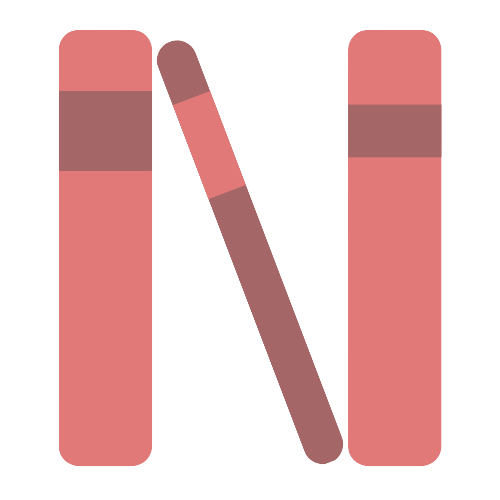

# nextbook {#identifier .light-pink .center}

### 👀 Overview
*nextbook* is an easy to use web application. It is designed to help you find the next book to add to your collection. Your book can be found by **category** or **subject**, the operation is very simple:
- the user types keywords in the textbox and presses the *search* button,
- all the books belonging to that category are shown to the user, who will have to choose a title to display,
- in the third section of the website it is possible to see the book cover and the description (if available).

### 🛠️ Built with
* <button class="item html" href="https://developer.mozilla.org/en-US/docs/Web/HTML">HTML</button>
* <button class="item sass" href="https://sass-lang.com/">Sass</button>
* <button class="item javascript" href="https://www.javascript.com/">JavaScript</button>
* <button class="item lodash" href="https://lodash.com/">Lodash</button>
* <button class="item webpack" href="https://webpack.js.org/">Webpack</button>

### 🚀 Quick Link
Click the button below to try the web application:

<button class="button" href="https://nextbookjs.netlify.app">try</button>

### 📖 Features
- **Dinamic Placeholder**: a little *hint* to help you choose a category,
- **Pagination**: after requesting data from the Open Library service - a third-party API - which will provide the user with a list of books related to the selected category, the books are displayed in pages of up to *4 books per page*,
- **Carousel**: it shows *two* book cover (if available),
- **Responsive Design**: optimized for desktops and smaller screen devices.

### ⚠️ License
*nextbook* is MIT licensed, see `LICENSE.md` for more information.

